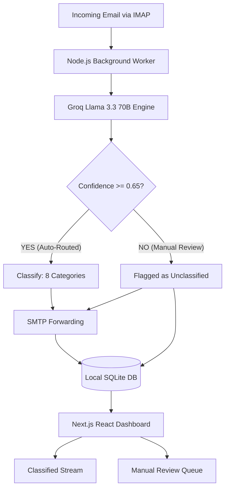

# 📥 Caldim Digital Postmaster

Welcome to the **Caldim Digital Postmaster**. This project is a fully integrated, AI-driven email automation and classification engine built natively with **Next.js** and **Node.js**.

The system connects directly to your company inbox, reads incoming emails in real-time, uses advanced LLMs (Llama 3.3 70B) to classify the emails into strict engineering-focused categories, saves them to a local database, and forwards a summarized routing slip to the appropriate department. Simultaneously, a React-based Dashboard provides a live command center to monitor, filter, and triage the email pipeline.

---

## 🗺️ 1. Architecture & Workflow

We have migrated completely off third-party automation tools (like n8n) in favor of a robust, self-hosted Node.js worker that runs perfectly alongside the Next.js frontend.



### The Two Engines
1. **The Background Worker (`src/worker/`)**: A standalone TypeScript daemon that listens to your IMAP inbox 24/7. It parses emails, calls the Groq API for AI classification, saves the results to SQLite, and uses Nodemailer to forward the routed emails.
2. **The Frontend Dashboard (`src/app/` & `src/components/`)**: A high-density Next.js web application that polls the SQLite database. It visualizes the data streams, displays categorizations, and serves as an interactive decision portal.

---

## 🧠 2. AI Classification Rules

The Groq AI Engine (Llama 3.3 70B) is strictly instructed to classify every incoming email into exactly **one** of the following 8 categories:

1. `project_proposal`: RFQs, tenders, quotation requests, engineering proposals.
2. `feedback_complaint`: Complaints, negative feedback, customer issues, escalations.
3. `invoice_payment`: Invoices, payment confirmations, billing matters, purchase orders.
4. `job_application`: Resumes, CVs, cover letters, internship applications.
5. `vendor_inquiry`: Supplier communications, procurement inquiries, product catalogs.
6. `general`: Newsletters, greetings, internal communications, marketing.
7. `vendor_quote`: Specific quotations returned by vendors.
8. `junk`: Spam or entirely irrelevant emails.

### Confidence Thresholding
The AI also assigns a **Confidence Score (0.0 to 1.0)**.
- **>= 0.65**: Automatically routed and trusted.
- **< 0.65**: Placed into the "Unclassified" queue for human triage in the UI.

---

## 🏗️ 3. Folder Structure

```text
caldim-digital-postmaster/
├── .env                        # Required environment credentials (IMAP, SMTP, GROQ)
├── caldim_postmaster.db        # The SQLite database holding all processed emails
├── package.json                # Project dependencies and concurrent startup scripts
├── src/
│   ├── app/                    # Next.js App Router (Pages & API endpoints)
│   ├── components/             # React UI Components (Inbox, Dashboard, Triage)
│   ├── hooks/                  # React Query hooks for fetching database data
│   ├── store/                  # Zustand state management
│   ├── types/                  # TypeScript interfaces
│   └── worker/                 # 🚀 THE NODE.JS AUTOMATION ENGINE
│       ├── index.ts                 # Main daemon loop
│       ├── emailService.ts          # IMAP listener and mail parser
│       ├── classificationService.ts # Groq API integration
│       ├── routingService.ts        # SMTP forwarding and HTML email templates
│       └── dbService.ts             # Direct SQLite insertions
```

---

## ⚙️ 4. Setup & Installation

### Prerequisites
- Node.js (v18+)
- An App Password for your IMAP/SMTP provider (e.g., Gmail)
- A Groq API Key

### 1. Install Dependencies
Run the following command to install both frontend and backend dependencies:
```bash
npm install
```

*(Note: If you run into issues with the SQLite driver, you may need to run `npm rebuild better-sqlite3`)*

### 2. Environment Configuration
Create a `.env` file in the root directory and populate it with your credentials:
```env
IMAP_HOST=imap.gmail.com
IMAP_PORT=993
IMAP_USER=your-email@gmail.com
IMAP_PASSWORD="your-app-password"

SMTP_HOST=smtp.gmail.com
SMTP_PORT=465
SMTP_USER=your-email@gmail.com
SMTP_PASSWORD="your-app-password"

GROQ_API_KEY=gsk_your_groq_api_key_here

PORT=3000
SQLITE_DB_PATH=./caldim_postmaster.db
```

### 3. Start the Engines
We use `concurrently` to boot up the Next.js web server and the Node.js background listener simultaneously with a single command.

```bash
npm run dev
```

You should see logs indicating that the `Next.js` server has started on `http://localhost:3000` AND that the `CALDIM DIGITAL POSTMASTER - NODE.JS WORKER` has connected to your IMAP server.

---

## 🎨 5. UI Customization

The dashboard is built using Tailwind CSS and follows the **Caldim Engineering Industrial Theme**:
- **Base Canvas**: `#0B0F19`
- **UI Panels**: `#151D30`
- **Caldim Teal**: `#0D9488`
- **Cyber Blue**: `#06B6D4`

You can modify these global variables inside `tailwind.config.ts`.

---
*Created and maintained by the Caldim Engineering Architect Team.*
