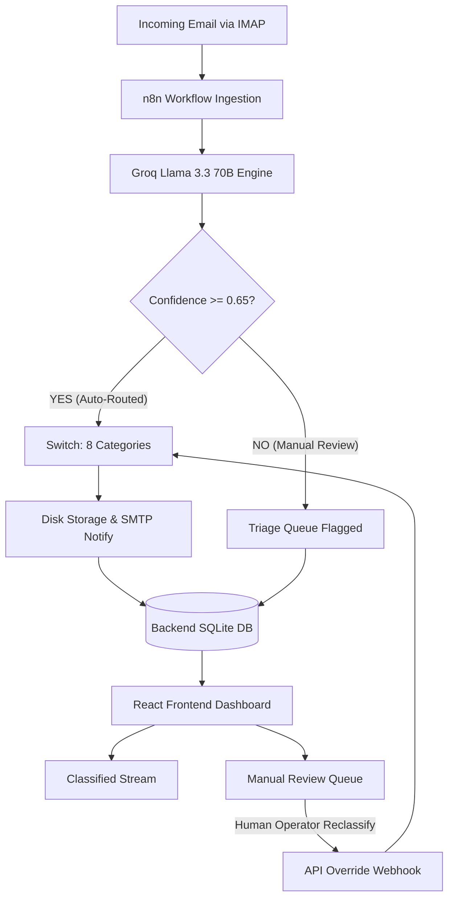

# 📥 Caldim Digital Postmaster: Master Blueprint

This document serves as the master architectural blueprint for integrating the React-based frontend dashboard with the **Caldim Digital Postmaster** n8n backend email automation engine. 

The React UI acts as the front-end command center, orchestrating real-time visualization of AI classifications, file attachments, and manual overrides for low-confidence streams.

> [!IMPORTANT]  
> All UI modifications, classification components, and metrics **MUST strictly align** with the 8 category naming schemas and the critical **0.65 confidence threshold logic gate** defined in the n8n workflow (`workflow.json`).

---

## 🗺️ 1. Project Overview: Caldim Digital Postmaster Dashboard

The Caldim Digital Postmaster system bridges advanced AI-driven email processing with an industrial, high-density dashboard. 



### Integration Model
1. **n8n Processing Pipeline**: Reads incoming emails, calls the Groq Llama 3.3 70B model to classify them, writes extracted attachments to local disk, and stores results in a SQLite database.
2. **React Frontend Dashboard**: Polls or subscribes to database updates via TanStack Query (React Query). It visualizes data streams, displays categorizations, and serves as an interactive decision portal.
3. **The Exception Desk (Manual Review Queue)**: Acts as a manual intervention fork representing the false branch of the n8n `If1` threshold node. Human actions directly override the classification data and push items back to the automated pipelines.

---

## 🗃️ 2. System Data Contract

To guarantee type safety across the network boundary, the frontend client uses a rigid TypeScript interface that matches the database and n8n engine models.

```typescript
export interface EmailItem {
  id: string;
  from: string;
  subject: string;
  textPlain: string;
  category: 
    | 'project_proposal'
    | 'feedback_complaint'
    | 'invoice_payment'
    | 'job_application'
    | 'vendor_inquiry'
    | 'general'
    | 'vendor_quote'
    | 'junk'
    | '';
  confidence: number; // Decimal value between 0.0 and 1.0
  priority: 'high' | 'medium' | 'low';
  processedAt: string; // ISO Timestamp matching n8n routing time
  status: 'classified' | 'unclassified'; // Status based on the 0.65 threshold
  attachments: Array<{
    fileName: string;
    contentType?: string;
    binaryKey: string;
  }>;
}
```

### API Integration & Synchronization Strategy

The React UI synchronizes state using **TanStack Query (React Query)** to handle data fetching, caching, and state invalidation.

```typescript
import { useQuery, useMutation, useQueryClient } from '@tanstack/react-query';
import axios from 'axios';

const API_BASE_URL = process.env.REACT_APP_N8N_WEBHOOK_URL || '/api';

// Fetch all emails
export const useEmails = () => {
  return useQuery<EmailItem[]>({
    queryKey: ['emails'],
    queryFn: async () => {
      const { data } = await axios.get(`${API_BASE_URL}/emails`);
      return data;
    },
    refetchInterval: 5000, // Background polling every 5 seconds for real-time monitoring
  });
};

// Mutate / Reclassify Email (Manual Review Override)
export const useReclassifyEmail = () => {
  const queryClient = useQueryClient();
  
  return useMutation({
    mutationFn: async ({ emailId, category }: { emailId: string; category: EmailItem['category'] }) => {
      const { data } = await axios.post(`${API_BASE_URL}/emails/reclassify`, {
        emailId,
        category,
      });
      return data;
    },
    onSuccess: () => {
      // Invalidate queries to trigger an immediate interface update
      queryClient.invalidateQueries({ queryKey: ['emails'] });
    },
  });
};
```

---

## 🏗️ 3. Modified React UI Architecture

The layout implements a high-density, engineering-centric design structure reflecting Caldim Engineering's visual identity.

### State Management (Zustand)
To manage local filter selections, active queues, and UI counters separately from server caching:

```typescript
import { create } from 'zustand';

interface TriageStore {
  activeCategoryFilter: string | null;
  searchQuery: string;
  setCategoryFilter: (category: string | null) => void;
  setSearchQuery: (query: string) => void;
  getCounts: (emails: EmailItem[]) => {
    classified: number;
    unclassified: number;
    byCategory: Record<string, number>;
  };
}

export const useTriageStore = create<TriageStore>((set) => ({
  activeCategoryFilter: null,
  searchQuery: '',
  setCategoryFilter: (category) => set({ activeCategoryFilter: category }),
  setSearchQuery: (query) => set({ searchQuery: query }),
  getCounts: (emails) => {
    const counts = {
      classified: 0,
      unclassified: 0,
      byCategory: {} as Record<string, number>,
    };

    emails.forEach((email) => {
      if (email.confidence >= 0.65) {
        counts.classified++;
        counts.byCategory[email.category] = (counts.byCategory[email.category] || 0) + 1;
      } else {
        counts.unclassified++;
      }
    });

    return counts;
  },
}));
```

---

### Component Blueprint

#### A. Dashboard Summary
* **Metric Cards**: Displaying aggregate counters for Total Emails, Auto-Routed, and Pending Triage.
* **Category Status Grid**: 8 cards representing the strict n8n categories:
  1. `project_proposal`
  2. `feedback_complaint`
  3. `invoice_payment`
  4. `job_application`
  5. `vendor_inquiry`
  6. `general`
  7. `vendor_quote`
  8. `junk`

#### B. EmailInboxView
* **High-Density List**: Minimalist table showing sender, subject, processing time, and confidence.
* **Color-coded Priority Badges**:
  * `high`: <span style="color: #ef4444; font-weight: bold;">🔴 High (Red)</span>
  * `medium`: <span style="color: #f97316; font-weight: bold;">🟠 Medium (Orange)</span>
  * `low`: <span style="color: #6b7280; font-weight: bold;">⚫ Low (Gray)</span>

#### C. ClassificationCard & AttachmentList
* Displays original email text, AI extraction confidence score, and a list of attachments.
* **AttachmentList Component**: Maps local binary identifiers to download streams. Clicking an attachment initiates file retrieval matching the backend directory.

#### D. ManualReviewQueue (Critical UI Fork)
* Accessible view containing only emails where `confidence < 0.65` and `status === 'unclassified'`.
* **Override Layout Controls**:
  ```tsx
  // Concept component snippet for Manual Review action buttons
  export function ManualReviewControls({ email }: { email: EmailItem }) {
    const reclassifyMutation = useReclassifyEmail();
    const categories: EmailItem['category'][] = [
      'project_proposal', 'feedback_complaint', 'invoice_payment', 
      'job_application', 'vendor_inquiry', 'general', 'vendor_quote', 'junk'
    ];

    return (
      <div className="p-4 border-t border-slate-700 bg-slate-900/50 rounded-b-lg">
        <p className="text-xs text-yellow-500 mb-2 font-mono">
          ⚠️ AI Category Guess: "{email.category}" ({(email.confidence * 100).toFixed(0)}% Confidence)
        </p>
        <span className="text-sm text-slate-300 block mb-3">Reassign Classification:</span>
        <div className="grid grid-cols-2 md:grid-cols-4 gap-2">
          {categories.map((cat) => (
            <button
              key={cat}
              onClick={() => reclassifyMutation.mutate({ emailId: email.id, category: cat })}
              disabled={reclassifyMutation.isPending}
              className="px-3 py-1.5 text-xs bg-slate-800 hover:bg-emerald-600 active:bg-emerald-700 text-white rounded border border-slate-700 transition duration-150 text-left truncate"
            >
              {cat.replace('_', ' ')}
            </button>
          ))}
        </div>
      </div>
    );
  }
  ```

---

## 🎨 4. Integration & UX Logic

### Confidence Visualization
To maintain branding and clarity, UI badges and meters reflect the AI's confidence levels using three brackets:

| Confidence Bracket | UI Color | Classification Quality |
| :--- | :--- | :--- |
| **0.90 to 1.00** | **Green (`#10b981`)** | Very Confident (Auto-routed) |
| **0.50 to 0.89** | **Yellow (`#f59e0b`)** | Moderately Confident (Threshold Warning if < 0.65) |
| **< 0.50** | **Red (`#ef4444`)** | Uncertain (Forces Queue Placement) |

### Dynamic Routing
Navigation uses **React Router v6** to keep state synchronizations reflected in the URL structure:
* `/` — High-level Command Center / Analytical Dashboard.
* `/triage` — The Manual Review Queue (`If1` fails).
* `/inbox/:category` — Filtered Inbox view displaying items successfully routed by n8n.
* `/email/:id` — Detailed drill-down showing email metadata, attachments, and audit trail logs.

### Tailwind CSS Design Configuration
Add Caldim Engineering's custom theme settings to `tailwind.config.js` to enable high-density layout styling:

```javascript
module.exports = {
  theme: {
    extend: {
      colors: {
        caldim: {
          dark: '#0B0F19',      // Base workspace canvas
          panel: '#151D30',     // UI components / cards
          border: '#23304E',    // Structure separators
          primary: '#0D9488',   // Caldim Industrial Teal
          accent: '#06B6D4',    // Cyber Blue
        }
      },
      fontSize: {
        'xxs': '0.7rem',        // Micro typography for data streams
      }
    }
  }
}
```

---

## 📁 5. Folder Structure & Replication

The system separates the integration configuration code from the client interface layer as detailed below:

```text
├── /n8n-config
│   └── workflow.json           # Master backup of the n8n logic
└── /react-ui
    ├── /public
    ├── /src
    │   ├── /components
    │   │   ├── DashboardSummary.tsx
    │   │   ├── EmailInboxView.tsx
    │   │   ├── ClassificationCard.tsx
    │   │   ├── AttachmentList.tsx
    │   │   └── ManualReviewQueue.tsx
    │   ├── /hooks
    │   │   ├── useEmailClassification.ts
    │   │   └── useAttachmentDownload.ts
    │   ├── /store
    │   │   └── triageStore.ts
    │   ├── /types
    │   │   └── email.ts
    │   ├── App.tsx
    │   ├── index.css
    │   └── index.tsx
    ├── tailwind.config.js
    └── tsconfig.json
```

### Essential Custom Hooks

#### `useEmailClassification.ts`
Manages classification actions, mapping query invalidation calls directly to the React Query pipeline to clean the user interface state immediately upon re-routing.

#### `useAttachmentDownload.ts`
Generates authorization tokens and parses API parameters to query the binary store.

---

## 🚀 6. Rebuilding & Configuring the System

### Environment Variables
Configure `.env` (or project settings) to target the workflow and coordinate requests:

```env
# URL pointing directly to the n8n instance's Webhook trigger/endpoint
REACT_APP_N8N_WEBHOOK_URL="http://localhost:5678/webhook/caldim-digital-postmaster"

# Key authorization header for requests passing through endpoints
REACT_APP_API_KEY="caldim_secure_postmaster_token_xyz"
```

### Attachment Storage Mapping Guide
In the n8n backend, attachments are processed by the file execution node and written to a directory structured by category:
```text
/home/node/.n8n-files/{{category}}/{{filename}}
```

To fetch files in the React application:
1. The backend exposes an endpoint at `GET /api/attachments/:id`.
2. The endpoint reads the binary file using standard Node file systems mapping to the volume storage folder:
   ```typescript
   // Pseudo-code for node controller handling file retrieval
   import fs from 'fs';
   import path from 'path';

   export async function getAttachment(emailCategory: string, fileName: string) {
     const basePath = '/home/node/.n8n-files';
     const resolvedPath = path.join(basePath, emailCategory, fileName);

     // Prevent directory traversal attacks
     if (!resolvedPath.startsWith(basePath)) {
       throw new Error('Access Denied');
     }

     if (!fs.existsSync(resolvedPath)) {
       throw new Error('File not found');
     }

     return fs.createReadStream(resolvedPath);
   }
   ```
3. The React front-end coordinates downloads via the `AttachmentList` UI by invoking this server download endpoint.

---
*Created and maintained by the Caldim Engineering Architect Team.*
